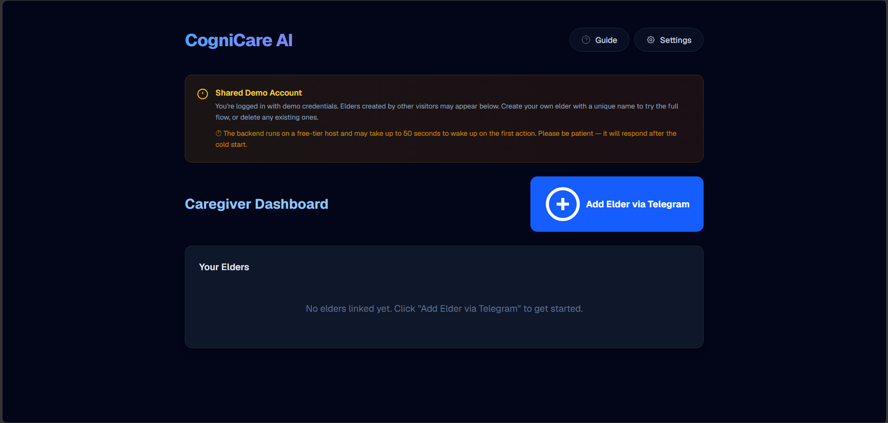
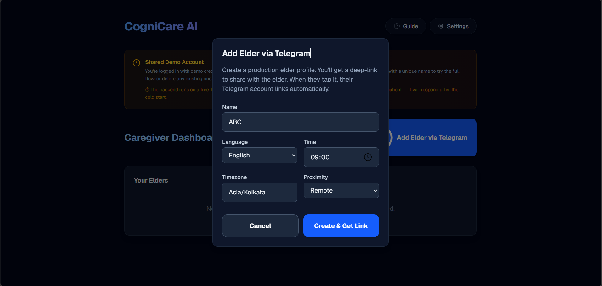
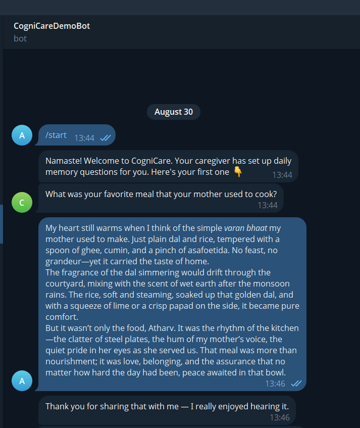
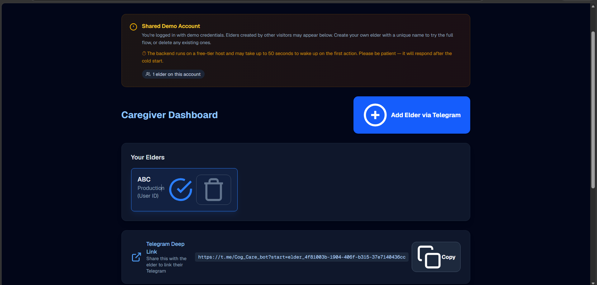

# CogniCare AI 🧠

**Full-Stack Multi-Agent Cognitive Wellness Platform for Elders**

CogniCare AI is an AI-driven cognitive engagement companion for elderly users, built as an MVP for the **AICTE | IBM SkillsBuild AI Automation & Intelligent Solutions Internship (BharatCares)**, addressing **UN SDG 3: Good Health & Well-being**.

Originally a local desktop application, the system has been re-architected into a scalable, secure, full-stack web application with an **async Celery pipeline**. It engages elders with daily memory-prompting questions (via **Telegram**), analyzes spoken/typed responses for emotional/cognitive signals, extracts long-term memories (RAG), and recommends personalized offline activities — while giving caregivers secure, authenticated visibility into historical trends via a Next.js dashboard.

---

## 📸 App Screenshots


| | |
|---|---|
| **Caregiver Dashboard** | **Elder Management** |
|  |  |
| **Telegram Bot — Multilingual Questions** | **Deep-Link Onboarding** |
|  |  |
| **Recommendations & Feedback** | **Interaction History & Insights** |
|  |  |
| **Weekly Report** | **Dark Mode UI** |
|  |  |

---

## Table of Contents
- [Tech Stack](#tech-stack)
- [Architecture Overview](#architecture-overview)
- [Key Features](#key-features)
- [Database Schema (V2)](#database-schema-v2)
- [Channels: Telegram (Production + Demo)](#channels-telegram-production--demo)
- [Installation & Setup](#installation--setup)
- [Local Development (Docker)](#local-development-docker)
- [Production Deployment (Render)](#production-deployment-render)
- [Environment Variables](#environment-variables)
- [Developer Roadmap](#developer-roadmap)
- [Phase Status](#phase-status)
- [Team](#team)

---

## Tech Stack

| Layer | Technology |
|-------|------------|
| **Frontend** | Next.js 14 (App Router), React 18, Tailwind CSS, TypeScript |
| **Backend API** | FastAPI, Python 3.11, Uvicorn |
| **Async Pipeline** | Celery 5.3 + Redis (Upstash/Render), Celery Beat scheduler |
| **Database & Auth** | Supabase (PostgreSQL + `pgvector`), Row Level Security |
| **LLM (Cloud)** | Groq (`llama-3.3-70b-versatile`, `whisper-large-v3-turbo`) |
| **Embeddings** | Hugging Face Inference Router (`sentence-transformers/all-MiniLM-L6-v2`, 384-dim) |
| **Messaging** | Telegram Bot API (production elder channel + recruiter demo) |
| **Observability** | Structured logging, Render logs |

---

## Architecture Overview

```
┌─────────────┐     ┌──────────────┐     ┌─────────────────┐
│  Elder      │────▶│  Telegram    │────▶│  FastAPI Webhook│
│  (Telegram) │     │  Bot API     │     │  /webhooks/     │
└─────────────┘     └──────────────┘     └────────┬────────┘
                                                   │
                            ┌──────────────────────┘
                            ▼
                     ┌──────────────┐     ┌─────────────────┐
                     │  Redis       │◀───▶│  Celery Worker  │
                     │  (Broker)    │     │  (5 queues)     │
                     └──────────────┘     └────────┬────────┘
                                                   │
         ┌─────────────────────────────────────────┼─────────────────────────────────────────┐
         ▼                                         ▼                                         ▼
┌──────────────────┐                    ┌──────────────────┐                    ┌──────────────────┐
│ scheduling queue │                    │   inbound queue  │                    │ fallback queue   │
│ dispatch_daily_  │                    │ process_telegram_│                    │ expire_stale_    │
│ questions        │                    │ update           │                    │ recommendations  │
└──────────────────┘                    └────────┬─────────┘                    └──────────────────┘
                                                 │
                    ┌────────────────────────────┼────────────────────────────┐
                    ▼                            ▼                            ▼
           ┌───────────────┐            ┌───────────────┐            ┌───────────────┐
           │ Interviewer   │            │  Evaluator    │            │ Coordinator   │
           │ Agent         │            │  Agent        │            │ Agent         │
           │ generate_     │            │ evaluate_     │            │ generate_     │
           │ question()    │            │ response()    │            │ recommendation()│
           └───────┬───────┘            └───────┬───────┘            └───────┬───────┘
                   │                            │                            │
                   │              ┌─────────────┴─────────────┐              │
                   │              ▼                           ▼              │
                   │     ┌───────────────┐            ┌───────────────┐      │
                   │     │ RAG Memory    │            │ Escalation    │      │
                   │     │ Extraction &  │            │ Check         │      │
                   │     │ Storage       │            │ (safety/      │      │
                   │     │ (pgvector)    │            │ engagement)   │      │
                   │     └───────────────┘            └───────────────┘      │
                   │                            │                            │
                   └────────────────────────────┼────────────────────────────┘
                                                ▼
                                    ┌─────────────────────┐
                                    │ Supabase (Postgres) │
                                    │ + pgvector          │
                                    └─────────────────────┘
```

**Key flows:**

1. **Caregiver Onboarding:** Dashboard → create elder (name, language, timezone) → get `t.me/Bot?start=elder_<uuid>` deep-link → share with elder
2. **Elder Links via Telegram:** Elder taps deep-link → bot links `telegram_user_id` → welcome message + first question
3. **Daily Questions (scheduled):** Celery Beat → `dispatch_daily_questions` → `send_daily_question` (per elder) → Telegram message in elder's language
4. **Inbound Reply (async):** Telegram update → enqueue `process_telegram_update` → transcribe (Whisper, for voice notes) → translate → evaluate → store insight → extract memories → generate recommendation → companion reply → next question
5. **Caregiver Feedback:** Dashboard → Done / Dismiss / Custom Suggestion → family interaction logged → suggestion sent to elder via Telegram
6. **Fallback Sweep (12h):** `expire_stale_recommendations` → pending → `timed_out`
7. **Weekly Report (Mon 07:00):** `generate_all_weekly_reports` → 7-day aggregates → `weekly_reports` table

---

## Key Features

### 🤖 AI-Powered Multilingual Companion
- Generates memory-prompting questions in **English, Hindi, Marathi, and Tamil**
- Uses natural script (Devanagari, Tamil) — not transliterated English
- Adapts difficulty based on engagement scores (easy → medium → hard)
- 7-day domain rotation: episodic memory, semantic memory, emotional well-being, etc.

### 👨‍👩‍👧 Caregiver Dashboard
- Real-time interaction history with sentiment & engagement insights
- AI-generated recommendations with Done / Dismiss / Custom Suggestion feedback
- Custom suggestions delivered to elder via Telegram
- Weekly reports with engagement trends
- Multi-elder support with per-elder deep-links

### 📱 Telegram Bot (Zero-Friction Access)
- **Production mode:** Deep-link onboarding (`t.me/Bot?start=elder_<uuid>`)
- **Demo mode:** Anyone taps `t.me/Bot` → auto-provisions demo elder
- Voice note support (Whisper transcription)
- Warm companion replies after each answer

### 🔒 Security & Auth
- Supabase Auth with JWT tokens
- Row Level Security on all database tables
- Webhook secret validation for Telegram
- Caregiver-scoped data access

---

## Database Schema (V2)

Managed via SQL migrations in `backend/database/migrations/`:

| Migration | Description |
|-----------|-------------|
| `0002_cognicare_v2_schema.sql` | Core V2 tables + RLS policies |
| `0003_add_telegram_chat_id.sql` | Telegram demo elder support (chat_id) |
| `0004_telegram_production.sql` | Telegram production elder support (user_id + deep-link) |

**Core tables:**

| Table | Purpose |
|-------|---------|
| `elder_profiles` | Elder config: name, language, timezone, proximity, mobility, `cycle_day` (1-7), `telegram_chat_id`, `telegram_user_id`, `onboarding_method` ('demo' \| 'production') |
| `daily_interactions` | One row per question: `elder_id`, `domain`, `question`, `raw_response`, `transcript_source`, `twilio_message_sid` (idempotency key, reused for `tg:<chat>:<msg>`) |
| `interaction_insights` | Evaluator output: `sentiment_label`, `engagement_level`, `topics[]`, `safety_flag` |
| `memories` | `pgvector` (384-dim) long-term memories: `elder_id`, `content`, `embedding`, `tags[]` |
| `recommendations` | Coordinator output: `recommendation_text`, `reason`, `status` (pending/done/dismissed/timed_out) |
| `family_interactions` | Caregiver feedback: `reaction` (done/dismiss), `caregiver_suggestion` |
| `weekly_reports` | 7-day aggregates: `avg_engagement`, `dominant_sentiment`, `topic_frequency`, `markdown_summary` |

**RLS:** Enabled on all tables. Policies enforce `caregiver_user_id` = `auth.uid()` for caregiver-scoped access.

---

## Channels: Telegram (Production + Demo)

| Aspect | Production Elder | Recruiter Demo |
|--------|-----------------|----------------|
| **Access** | Deep-link `t.me/Bot?start=elder_<uuid>` | Public `t.me/Bot` → `/start` |
| **Elder onboarding** | Caregiver creates elder → shares deep-link | Auto-provisioned on first `/start` |
| **Elder identity** | `telegram_user_id` (from `message.from.id`) | `telegram_chat_id` (from `message.chat.id`) |
| **Languages** | ✅ English, Hindi, Marathi, Tamil | ✅ English, Hindi, Marathi, Tamil |
| **Voice notes** | ✅ Whisper transcription | ✅ Whisper transcription |
| **Scheduled questions** | ✅ Celery Beat at `preferred_interaction_time` | ❌ On-demand only |
| **Cost** | **Free** (Bot API) | **Free** (Bot API) |

---

## Installation & Setup

### Prerequisites
- Docker Desktop (includes Docker Compose)
- Supabase project (PostgreSQL + `pgvector` extension)
- Groq API key (LLM + Whisper)
- Hugging Face API key (embeddings)
- Telegram bot token (from @BotFather)

---

## Local Development (Docker)

**1. Clone & configure:**
```bash
git clone https://github.com/Atharv-Bandekar/CogniCare
cd CogniCare
cp .env.example .env
# Edit .env with your keys (see Environment Variables below)
```

**2. Run Supabase migrations:**
```bash
# In Supabase Dashboard → SQL Editor, run:
# backend/database/migrations/0002_cognicare_v2_schema.sql
# backend/database/migrations/0003_add_telegram_chat_id.sql
# backend/database/migrations/0004_telegram_production.sql
```

**3. Start local stack:**
```bash
docker compose up --build -d
```
Services:
- `api` — FastAPI on `http://localhost:8000` (Swagger at `/docs`)
- `worker` — Celery worker (all 5 queues)
- `beat` — Celery Beat scheduler
- `redis` — Redis 7 (local)

**4. Start the frontend:**
```bash
cd frontend
cp .env.example .env.local  # or create manually
# Set NEXT_PUBLIC_API_URL=http://localhost:8000
npm install
npm run dev
```
Frontend runs at `http://localhost:3000`.

**5. Register Telegram webhook (for local tunnel testing):**
```bash
# Start cloudflared tunnel to localhost:8000
cloudflared tunnel --url http://localhost:8000
# Copy the https URL, update .env:
# TELEGRAM_WEBHOOK_URL=https://your-tunnel.trycloudflare.com/webhooks/telegram/inbound
docker compose exec api python -c "
from backend.integrations.telegram_client import set_webhook
print(set_webhook())
"
```

**6. Test:** Open `t.me/YourBotUsername` → `/start`

---

## Production Deployment (Render)

**Services created via `render.yaml` Blueprint:**

| Service | Type | Command |
|---------|------|---------|
| `cognicare` | Web Service (Docker) | `honcho start` (FastAPI + Celery worker) |
| `cognicare-redis` | Redis (Free) | Managed by Render |

**Deploy:**
1. Push `render.yaml` to `main`
2. Render Dashboard → New → Blueprint → connect repo
3. Add environment variables (see below)
4. Deploy → watch logs for `honcho` starting both processes

**Register production webhook:**
```bash
curl -X POST "https://api.telegram.org/botYOUR_TOKEN/setWebhook" \
  -H "Content-Type: application/json" \
  -d '{"url": "https://cognicare-backend.onrender.com/webhooks/telegram/inbound", "drop_pending_updates": true}'
```

---

## Environment Variables

Create `.env` from `.env.example`:

```env
# =============================================================================
# Supabase (REQUIRED — backend crashes at import if missing)
# =============================================================================
SUPABASE_URL=https://your-project-ref.supabase.co
SUPABASE_SERVICE_ROLE_KEY=your-service-role-key

# =============================================================================
# LLM (Groq)
# =============================================================================
LLM_PROVIDER=groq
GROQ_API_KEY=gsk_your_key
GROQ_MODEL=llama-3.3-70b-versatile
GROQ_WHISPER_MODEL=whisper-large-v3-turbo

# =============================================================================
# Embeddings (Hugging Face Inference Router)
# =============================================================================
HUGGINGFACE_API_KEY=hf_your_token

# =============================================================================
# Celery / Redis
# =============================================================================
# Local: redis://redis:6379/0 (docker-compose overrides)
# Render: auto-injected from cognicare-redis service
CELERY_BROKER_URL=redis://localhost:6379/0
CELERY_RESULT_BACKEND=redis://localhost:6379/0
CELERY_TIMEZONE=Asia/Kolkata

# =============================================================================
# Telegram Bot
# =============================================================================
TELEGRAM_BOT_TOKEN=123456:ABC-DEF-your-token
TELEGRAM_BOT_USERNAME=YourBotUsername
TELEGRAM_WEBHOOK_URL=https://cognicare-backend.onrender.com/webhooks/telegram/inbound
TELEGRAM_WEBHOOK_SECRET=your-random-secret-string
TELEGRAM_VALIDATE_SECRET=true
TELEGRAM_DEMO_CAREGIVER_ID=uuid-from-supabase-auth-users-table
```

**Frontend** (`frontend/.env.local`):
```env
NEXT_PUBLIC_SUPABASE_URL=https://your-project-ref.supabase.co
NEXT_PUBLIC_SUPABASE_ANON_KEY=your-anon-key
NEXT_PUBLIC_API_URL=https://cognicare-backend.onrender.com
NEXT_PUBLIC_TELEGRAM_BOT_USERNAME=YourBotUsername
```

---

## Developer Roadmap

### 🧠 AI Agents (`backend/agents/`)
| File | Responsibility |
|------|----------------|
| `interviewer.py` | Generates daily memory questions (DDA + RAG context, multilingual) |
| `evaluator.py` | `evaluate_response(text)` → structured insight (sentiment, engagement, topics, safety) |
| `coordinator.py` | `generate_recommendation(elder, evaluator_output, domain, memories, weather)` → caregiver recommendation |
| `companion.py` | Warm, user-facing reply for Telegram channel (acknowledges elder's actual words) |
| `escalation.py` | `check_escalation(elder_id, evaluator_output)` → safety/engagement alerts |
| `report_generator.py` | `generate_weekly_report(elder_id, insights_7d)` → markdown summary |
| `question_engine.py` | Domain rotation (7-day), difficulty adaptation, RAG context building |
| `embeddings.py` | HF Inference Router client (fixed endpoint) |
| `base.py` | Shared LLM caller (Groq / Gemini), translation helpers |

### ⚙️ Celery Pipeline (`backend/celery_app/`)
| File | Responsibility |
|------|----------------|
| `config.py` | Queues, routes, acks_late, time limits, beat schedule import |
| `beat_schedule.py` | Cron definitions: daily questions (15min), fallback (12h), weekly reports (Mon 07:00) |
| `tasks/scheduling.py` | `dispatch_daily_questions`, `send_daily_question` |
| `tasks/telegram_bot.py` | Telegram on-demand pipeline (full agent chain: interview → evaluate → recommend → companion) |
| `tasks/shared_helpers.py` | Cross-channel helpers: translation, memory storage, escalation, weather |
| `tasks/fallback.py` | `expire_stale_recommendations` |
| `tasks/reports.py` | `generate_all_weekly_reports`, `generate_weekly_report_for_elder` |

### 🔌 Webhooks (`backend/webhooks/`)
| File | Purpose |
|------|---------|
| `telegram_webhook.py` | `POST /webhooks/telegram/inbound` — secret token validation, enqueues to `inbound` queue |

### 🗄️ Database (`backend/database/`)
| File | Purpose |
|------|---------|
| `db.py` | All Supabase CRUD + helpers (elder CRUD with cascade deletes, deep-link support, interaction management) |

### 🌐 API Routes (`backend/api/routes/`)
| File | Endpoints |
|------|-----------|
| `elders.py` | `POST /api/elders/telegram` (create), `GET /{id}/deep-link`, `GET/PATCH/DELETE /{id}` |
| `recommendations.py` | `GET /{id}/recommendations`, `POST /done|dismiss|suggest` (with Telegram delivery) |
| `reports.py` | `GET /{id}/weekly-reports`, `GET /{id}/weekly-reports/latest` |

### 🖥️ Frontend (`frontend/src/`)
| Path | Purpose |
|------|---------|
| `components/features/DashboardTab.tsx` | Caregiver dashboard (elder list, deep-links, recommendations, interaction history, weekly reports) |
| `components/features/RecommendationCard.tsx` | Recommendation card with Done/Dismiss/Suggest actions |
| `components/layout/SettingsSidebar.tsx` | Language, accessibility settings |
| `lib/api/recommendations.ts` | API client for recommendation actions |

---

## Phase Status

| Phase | Status | Description |
|-------|--------|-------------|
| **Phase 1-2** | ✅ Complete | Desktop app, core agents, database schema |
| **Phase 3A** | ✅ Complete | Evaluator, escalation, weekly reports |
| **Phase 3B** | ✅ Complete | Async Celery pipeline, webhook auth, beat scheduler |
| **Telegram Integration** | ✅ Live | Production + demo channels, deep-link onboarding, multilingual |
| **Caregiver Dashboard** | ✅ Live | Next.js frontend, Supabase auth, recommendations, weekly reports |
| **Render Deployment** | ✅ Live | Docker + honcho + Upstash Redis on Render Free tier |

---

## Team

Developed by **Atharv Bandekar** and **Shubham Govekar** for the AICTE | IBM SkillsBuild Internship (BharatCares).

- **Atharv (Member A):** Backend architecture, AI agents, Celery pipeline, Telegram integration, deployment
- **Shubham (Member B):** Frontend, Database schema, Supabase/RLS, initial Twilio integration

---

## License

MIT — see `LICENSE` for details.
